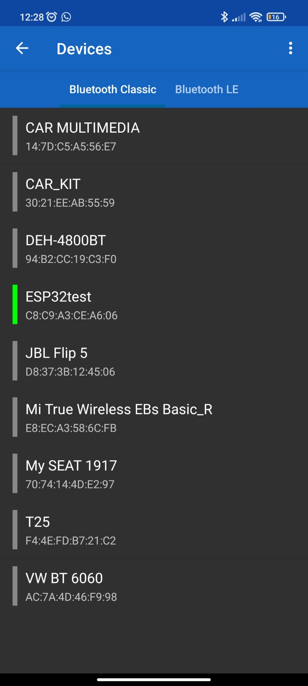
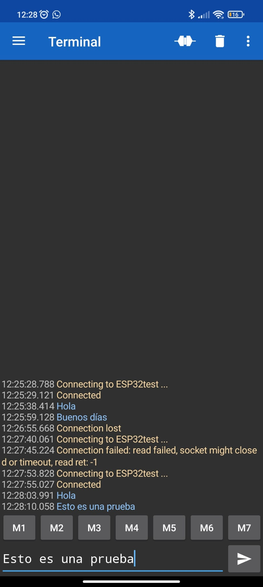

# PRACTICA 3  : WIFI y BLUETOOTH

## B: COMUNICACIÓN BLUETOOTH CON EL MOVIL

En esta práctica, deseamos realizar la conexión de nuestra placa ESP 32 a nuestro telefono movil mediante bluetooth.

### Código

```cpp
#include "BluetoothSerial.h"

#if !defined(CONFIG_BT_ENABLED) || !defined(CONFIG_BLUEDROID_ENABLED)
#error Bluetooth is not enabled! Please run `make menuconfig` to and enable it
#endif

BluetoothSerial SerialBT;

void setup() {
  Serial.begin(115200);
  SerialBT.begin("ESP32test"); 
  Serial.println("The device started, now you can pair it with bluetooth!");
}

void loop() {
  if (Serial.available()) {
    SerialBT.write(Serial.read());
  }
  if (SerialBT.available()) {
    Serial.write(SerialBT.read());
  }
  delay(20);
}
```

### Funcionamiento del programa

En primer lugar, necesitaremos la librería "BluetoothSerial.h" para poder realizar la conexión. A continuación comprobaremos que la conexión se haya hecho de forma correcta y inicializaremos una variable tipo BluetoothSerial que llamaremos "SerialBT".

```cpp
#include "BluetoothSerial.h"

#if !defined(CONFIG_BT_ENABLED) || !defined(CONFIG_BLUEDROID_ENABLED)
#error Bluetooth is not enabled! Please run `make menuconfig` to and enable it
#endif

BluetoothSerial SerialBT;
```

Ahora vamos a definir la función Setup que tiene como objetivo inicializar el dispositivo serie Bluetooth y le asigna un nombre (en este caso "ESP32test"). Finalmente nos devuelve un mensaje para comprobar que se ha realizado la conexión de forma exitosa.

```cpp
void setup() {
  Serial.begin(115200);
  SerialBT.begin("ESP32test"); 
  Serial.println("The device started, now you can pair it with bluetooth!");
}
```

Para terminar vamos a declarar la función Loop que tiene como objetivo comprobar si estamos recibiendo bytes de información por el puerto serie o si hay bytes disponibles para leer.

```cpp
void loop() {
  if (Serial.available()) {
    SerialBT.write(Serial.read());
  }
  if (SerialBT.available()) {
    Serial.write(SerialBT.read());
  }
  delay(20);
}
```

### Salida por el Terminal





